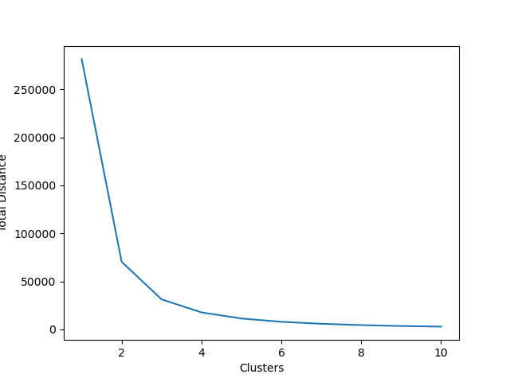

# ACM Research Coding Challenge (Fall 2020)

## Question One

 
Given the following dataset in `ClusterPlot.csv`, determine the number of clusters by using any clustering algorithm. **You're allowed to use any Python library you want to implement this**, just document which ones you used in this README file. Try to complete this as soon as possible.

Regardless if you can or cannot answer the question, provide a short explanation of how you got your solution or how you think it can be solved in your README.md file.

## Solution

To find the best number of means for a k-means clustering problem, I chose to use the "elbow method." By graphing the total distance from each point to its cluster's centroid, I was able to spot the elbow spot with 3 clusters. Implementation can be seen in `main.py`.

Libraries used:

1. Pandas for importing CSV
2. SKLearn for K-Means clustering algorithm
3. Matplotlib for graph

Sources:

1. [StackOverflow post for inertia_](https://stackoverflow.com/questions/19197715/scikit-learn-k-means-elbow-criterion)
